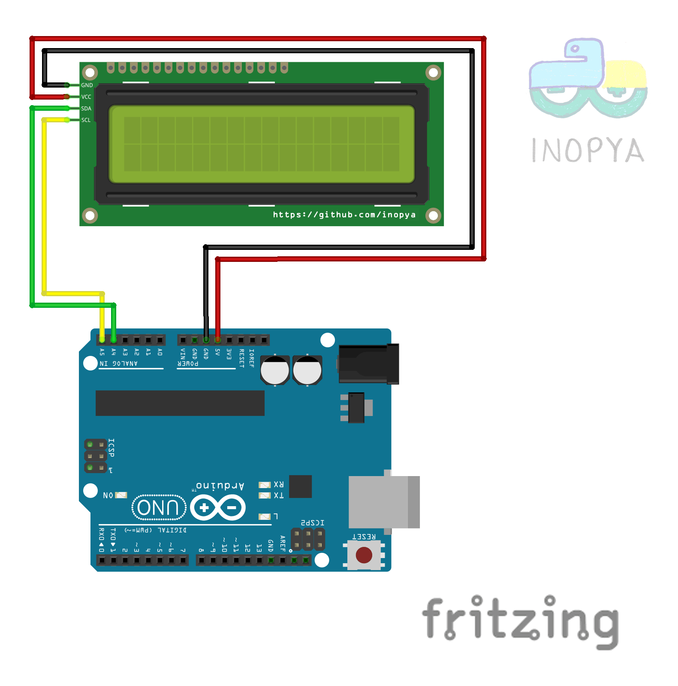
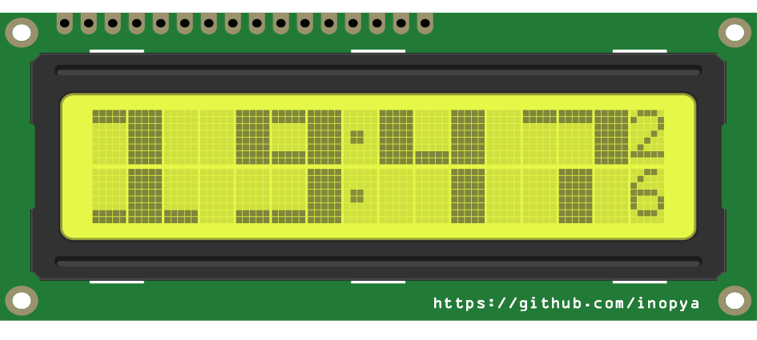

# BIG NUMEROS demo:

     
```diff
+===== NOTAS DE LA VERSION =====
```	  
 - Programa demostracion de la funcion BIG NUMERO.
   Util para relojes RCT, temporizadores con millis() o simples contadores.

```diff
+===== OPCIONES DISPONIBLES =====  
```	
   Esta demostracion cuenta las opciones siguientes opciones todas ellas basadas en temporizacion con millis()
   1) Reloj.
   2) Temporizador creciente.
   3) Cuenta atras.
   
   
Me he contrado con varias librerias LCD_i2c con el mismo nombre pero pequeñas variaciones. Asi que para no incurrir en errores  adjunto en un fichero .rar las que se usa en este montaje


   >> Fecha: 07/09/2015
   
     Funcion Big numeros para crear caracteres 3x2 en lcd_16X2 para Arduino.
     Tamaño actual compilado con Arduino IDE 1.8.10 >> 4356 bytes de programa y 419 bytes de uso de RAM


```diff
+===== ESQUEMA DE CONEXION ===== 
```	




```diff
+===== DISPLAY MOSTRANDO LA HORA (Luz encendida)  ===== 
```	



